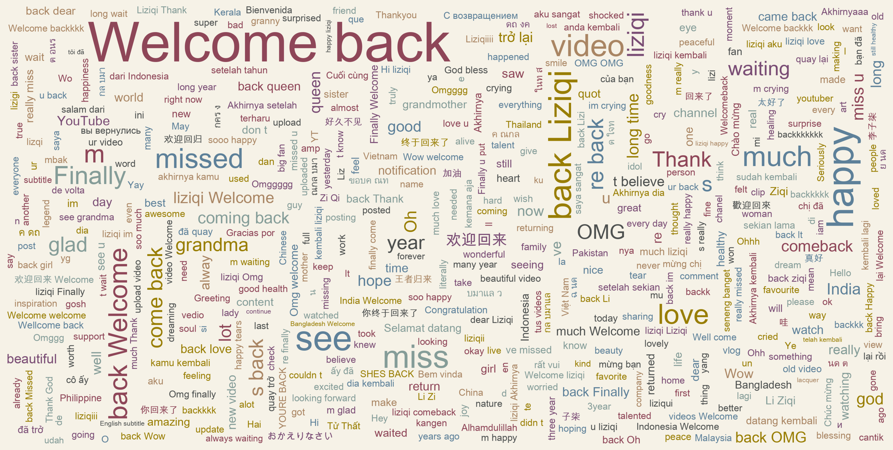

# Li Ziqi YouTube Video Comments Analysis

A data analysis project that scrapes and analyzes comments from Li Ziqi's comeback YouTube video [Carved lacquer with hidden flowers, carrying auspiciousness!](https://www.youtube.com/watch?v=IrXjnw8BpM0) released on November 12, 2024.

## Prerequisites

To collect video data, you'll need a YouTube Data API key. Here's how to get one:

1. Visit the [Google Cloud Console](https://console.cloud.google.com)
2. Create a new project or select an existing one
3. Enable the YouTube Data API v3
4. Create credentials (API key)
5. Rename `.env.example` to `.env`
6. Add your API key to the `.env` file
